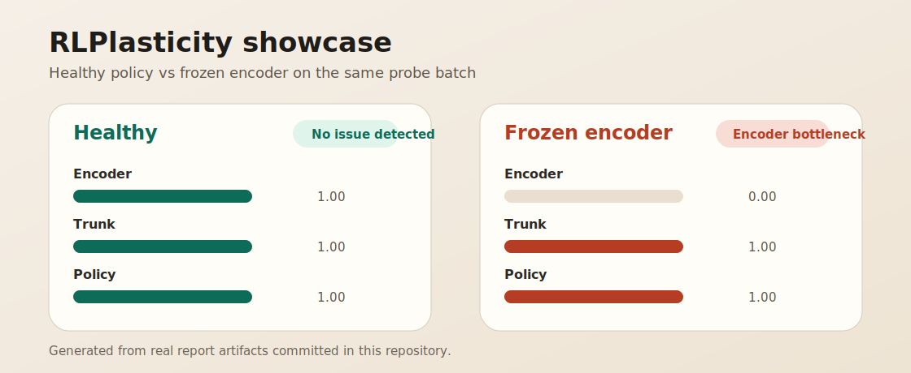

# RLPlasticity

Low-cost plasticity diagnostics for reinforcement learning models.

`RLPlasticity` helps you answer a practical question before you spend time on expensive reruns or ablations:

**Does this RL model still look capable of adapting, and where does a plasticity problem seem to concentrate?**

This project is built for fast triage, not experiment replacement. It is most useful when training gets weird and you want a cheap first pass before touching reward design, environment code, or large training jobs.

## What It Looks Like In Practice

Healthy checkpoint vs a checkpoint with a frozen encoder:



The showcase above is generated from real report files committed in this repository.

Healthy plasticity probe output:

```text
RLPlasticity Report | analyzer=plasticity/default | kind=plasticity_probe | evidence=update | layers=3
loss=1.448104
summary=No acute issue detected. Plasticity score=1.000 (update-active=1.000, grad-active=1.000)

Findings
- No diagnostic rule fired.
```

Frozen-encoder plasticity probe output:

```text
RLPlasticity Report | analyzer=plasticity/default | kind=plasticity_probe | evidence=update | layers=3
loss=1.448104
summary=The encoder is adapting less than downstream layers.

Findings
- [medium/medium] The encoder is adapting less than downstream layers.
  evidence: encoder_plasticity_score=0.000
  evidence: reference_downstream_score=1.000
```

Real generated artifacts:

- Healthy plasticity text: [docs/showcase/healthy_plasticity_probe.txt](docs/showcase/healthy_plasticity_probe.txt)
- Healthy plasticity JSON: [docs/showcase/healthy_plasticity_probe.json](docs/showcase/healthy_plasticity_probe.json)
- Healthy plasticity HTML: [docs/showcase/healthy_plasticity_probe.html](docs/showcase/healthy_plasticity_probe.html)
- Frozen encoder text: [docs/showcase/frozen_encoder_plasticity_probe.txt](docs/showcase/frozen_encoder_plasticity_probe.txt)
- Frozen encoder JSON: [docs/showcase/frozen_encoder_plasticity_probe.json](docs/showcase/frozen_encoder_plasticity_probe.json)
- Frozen encoder HTML: [docs/showcase/frozen_encoder_plasticity_probe.html](docs/showcase/frozen_encoder_plasticity_probe.html)

Example JSON excerpt:

```json
{
  "analyzer_name": "plasticity/default",
  "snapshot": {
    "kind": "plasticity_probe",
    "evidence_level": "update",
    "loss": 1.448103904724121
  },
  "metrics": {
    "plasticity_score": {
      "value": 1.0,
      "summary": "Plasticity score=1.000 (update-active=1.000, grad-active=1.000)"
    },
    "encoder_plasticity_score": {
      "value": 1.0,
      "summary": "encoder plasticity score=1.000"
    }
  },
  "findings": []
}
```

## What This Project Is For

Use `RLPlasticity` when you want to inspect:

- a single `actor.pt` or `policy.pt`
- a checkpoint plus model code
- a checkpoint plus model plus a small batch of replay or environment samples

The toolkit is designed to help with questions like:

- Does this checkpoint look structurally suspicious?
- Is the model responding normally on real inputs?
- Are gradients and updates still reaching the encoder, trunk, and heads?
- Does the issue look global, encoder-side, or head-side?

## What This Project Is Not

This first release does **not** try to decide whether a failure comes from:

- reward design
- exploration
- data collection
- environment bugs
- training orchestration issues outside the model

It focuses only on **model plasticity** and reports evidence with explicit caveats.

## User Scenarios

`RLPlasticity` supports three progressively stronger workflows.

### 1. `scan_checkpoint`
You have:
- only a checkpoint or `state_dict`

You get:
- parameter norm and sparsity statistics
- `encoder / trunk / policy / value` grouping
- low-confidence structural hints

Best for:
- “I only have `actor.pt`, is anything obviously strange?”

### 2. `probe_model`
You have:
- a loadable model
- one batch of samples
- optionally a checkpoint to load

You get:
- forward-only activation health
- low-response hints
- a cheap sanity check before running update probes

Best for:
- “Does this model even respond normally on real observations?”

### 3. `probe_plasticity`
You have:
- a loadable model
- one or more batches
- a loss function
- an optimizer
- optionally a checkpoint to load

You get:
- gradient reachability
- relative update strength
- stagnant-layer statistics
- encoder/trunk/head plasticity hints

Best for:
- “Is this checkpoint still learning, or has part of the model gone stale?”

## Installation

Install the package:

```bash
pip install -e .
```

Install with PyTorch support:

```bash
pip install -e ".[torch]"
```

## Quick Start

### A. Analyze a checkpoint directly

```python
from rlplasticity import scan_checkpoint

report = scan_checkpoint("actor.pt")
print(report.to_text())
```

### B. Run a forward-only probe

```python
from rlplasticity import probe_model

report = probe_model(model, batch_obs)
print(report.to_text())
```

### C. Run a low-cost plasticity probe

```python
from rlplasticity import probe_plasticity

report = probe_plasticity(
    model,
    [batch],
    loss_fn=loss_fn,
    optimizer=optimizer,
)

print(report.to_text())
```

## CLI Usage

Static checkpoint scan:

```bash
rlplasticity scan --checkpoint actor.pt
```

Forward-only probe:

```bash
rlplasticity probe-model \
  --builder mypkg.models:build_actor \
  --samples batch.pt \
  --checkpoint actor.pt \
  --forward mypkg.probes:forward_batch
```

Plasticity probe:

```bash
rlplasticity probe-plasticity \
  --builder mypkg.models:build_actor \
  --samples batch.pt \
  --loss mypkg.losses:actor_loss \
  --optimizer mypkg.optim:build_optimizer \
  --checkpoint actor.pt \
  --max-steps 8
```

## Real Example In This Repo

This repository ships a demo actor case with:

- `build_actor`
- `build_optimizer`
- `forward_batch`
- `actor_loss`
- `export_demo_artifacts`

Generate a reusable demo checkpoint and batch:

```bash
python -m examples.rl_actor_case --output-dir reports/demo_rl_actor_case
```

Run the demo end-to-end:

```bash
python -m examples.rl_actor_case --output-dir reports/demo_rl_actor_case --run
```

Or probe the generated files through the CLI:

```bash
rlplasticity probe-model \
  --builder examples.rl_actor_case:build_actor \
  --samples reports/demo_rl_actor_case/batch.pt \
  --checkpoint reports/demo_rl_actor_case/actor.pt \
  --forward examples.rl_actor_case:forward_batch
```

```bash
rlplasticity probe-plasticity \
  --builder examples.rl_actor_case:build_actor \
  --samples reports/demo_rl_actor_case/batch.pt \
  --loss examples.rl_actor_case:actor_loss \
  --optimizer examples.rl_actor_case:build_optimizer \
  --checkpoint reports/demo_rl_actor_case/actor.pt \
  --max-steps 1
```

Generate the homepage showcase artifacts:

```bash
python -m examples.showcase_reports --output-dir docs/showcase
```

## What You Get Back

Each report includes:

- analysis mode
- evidence strength
- key metrics
- findings
- caveats
- a shortlist of layers worth checking next

Reports can be rendered as:

- text
- HTML
- JSON via `report.to_dict()`

## Repository Layout

```text
src/rlplasticity/
  core/          # shared schemas, enums, aggregation, base interfaces
  ingest/        # checkpoint loading and static summarization
  probes/        # evidence collection workflows
  plasticity/    # metrics, rules, analyzers
  reporting/     # text/html rendering
  api.py         # public Python workflows
  cli.py         # command-line entry point
```

See [ARCHITECTURE.md](/C:/Users/22050/Desktop/RLPlasticityLab/docs/ARCHITECTURE.md) for the framework design.

## Open Source Standards

This repository currently uses:

- License: MIT, see [LICENSE](/C:/Users/22050/Desktop/RLPlasticityLab/LICENSE)
- Contribution guide: [CONTRIBUTING.md](/C:/Users/22050/Desktop/RLPlasticityLab/CONTRIBUTING.md)
- Code of conduct: [CODE_OF_CONDUCT.md](/C:/Users/22050/Desktop/RLPlasticityLab/CODE_OF_CONDUCT.md)
- Security policy: [SECURITY.md](/C:/Users/22050/Desktop/RLPlasticityLab/SECURITY.md)

## Security Notes

This project currently works with PyTorch checkpoints and `torch.load(...)`.

That means:

- only load checkpoints you trust
- treat untrusted model files as potentially unsafe
- prefer isolated environments when inspecting third-party artifacts

See [SECURITY.md](/C:/Users/22050/Desktop/RLPlasticityLab/SECURITY.md) for the project policy.

## Development

Run the test suite:

```bash
PYTHONPATH=src;. python -m unittest discover -s tests -v
```

Current coverage includes:

- analyzer logic
- CLI behavior
- report serialization
- robustness edge cases
- optional PyTorch API and CLI integration

## Roadmap

Planned next:

- more pathological demo cases such as frozen encoders and weak heads
- checkpoint sequence analysis
- stronger short-window trend analysis
- CleanRL / SB3 integration helpers
- lower-overhead online monitoring
